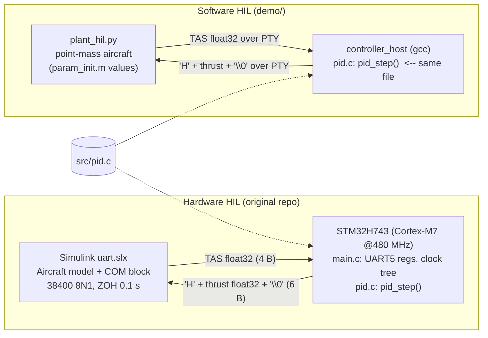
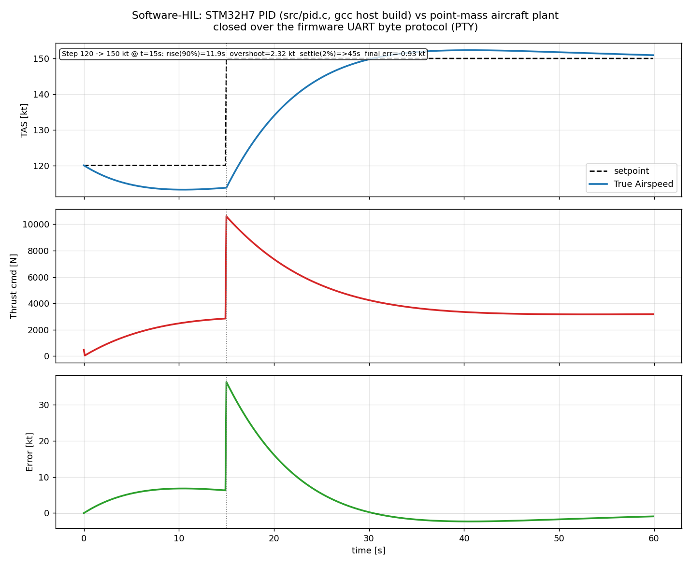
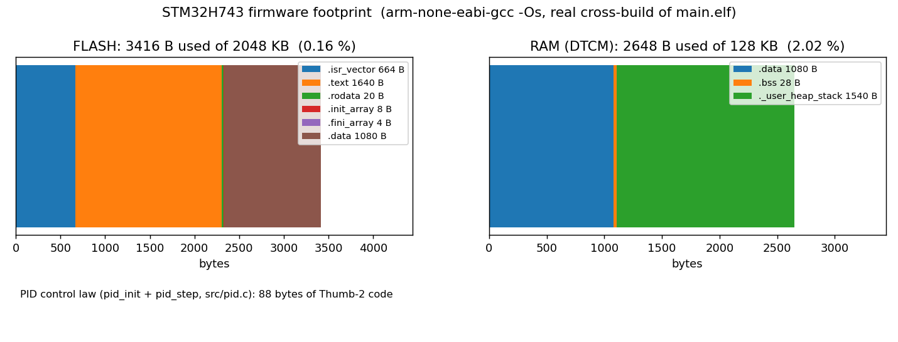

# Demo — Stage 3: bare-metal STM32H743 PID firmware, software-HIL

Single entry point:

```sh
sudo apt-get install -y gcc-arm-none-eabi     # cross toolchain
pip install matplotlib                        # host plots
./demo/run_demo.sh                            # ~5 s, writes demo/out/
REALTIME=0.05 ./demo/run_demo.sh              # slowed loop for a live terminal view
```

## What is real vs. host-simulated

| Piece | Runs where | Notes |
|---|---|---|
| `src/main.c`, `src/system_stm32h7xx.c`, `startup/*.s`, linker script | **Cross-compiled for the target** (`arm-none-eabi-gcc -mcpu=cortex-m7 -mfpu=fpv5-d16`) -> `demo/out/main.elf`, `main.bin` | Not executed here (needs the DevEBox STM32H743 board, `make flash`). Size report in `demo/out/size_report*.txt`, `firmware_footprint.png`. |
| `src/pid.c` / `include/pid.h` — discrete PID control law + `custom_float_t` | **Both**: linked into `main.elf` *and* compiled with host `gcc` into `demo/host/controller_host` | Same source file, byte-for-byte. Extracted from the original `main()` loop; gains `k_p=500, k_i=30, k_d=10`, `d=0.1 s` unchanged. |
| UART byte protocol (`TAS` float32 in; `'H'` + thrust float32 + `'\0'` out) | **Host**, over a PTY | `controller_host.c` re-implements only `UART_send_blocking/UART_rcv_blocking` on a tty fd; the frame layout is the firmware's. |
| Aircraft plant | **Host**, Python (`demo/host/plant_hil.py`) | Point-mass level-flight model with the parameters of `Simulink/param_init.m` / `get_rho.m` (M=2994 kg, S=30.19 m², h=3000 m, Cl/Cd polars). Stands in for the "Aircraft model" subsystem of `Simulink/uart.slx`. |
| Plots / metrics | Host | `hil_step_response.png`, `hil_run.csv`, `hil_summary.txt` |

Not done: running `main.elf` under Renode/QEMU (no STM32H7 UART5/RCC model readily available; skipped per the time budget).

## Architecture



## Outputs (`demo/out/`)

- `size_report.txt` / `size_report_full.txt` — `arm-none-eabi-size` / `nm` of the target image
- `firmware_footprint.png` — flash & RAM usage chart
- `hil_step_response.png` — TAS vs setpoint, thrust command, error (120 -> 150 kt step at t=15 s)
- `hil_run.csv`, `hil_summary.txt` — raw time series and step metrics
- `main.elf`, `main.bin` — flashable target binaries (ignored by git)



