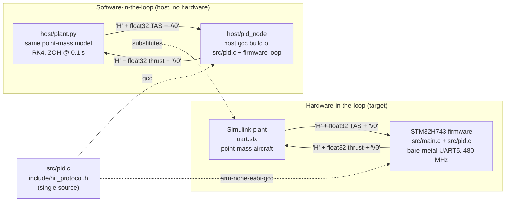
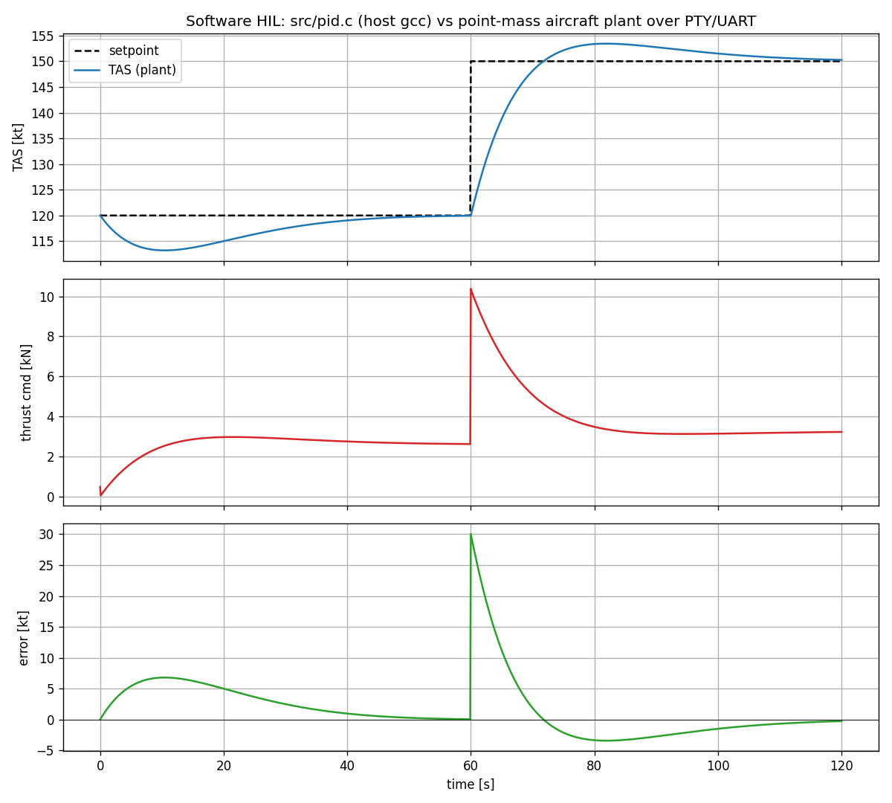
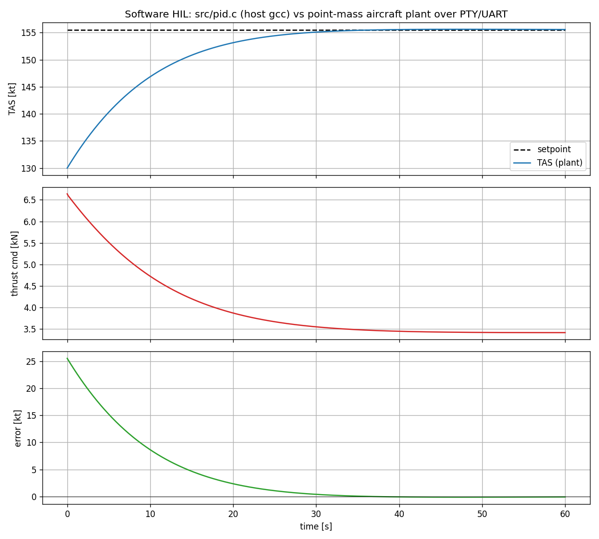

# Software HIL: same control code, same plant, before hardware

> Hand-written safety-critical control code, tested in the loop against the
> same plant model — before hardware, and again on hardware.

## Architecture

The PID control law lives in `src/pid.c` and knows nothing about registers.
The byte protocol (`custom_float_t`, `'H'` header, `'\0'` terminator and the
`hil_rx_t` receive state machine that resynchronises on it) lives in
`include/hil_protocol.h`. Both files are compiled twice:

| Build            | Compiler          | I/O                             | Plant                              |
|------------------|-------------------|---------------------------------|------------------------------------|
| `make`           | `arm-none-eabi-gcc` (Cortex-M7, FPv5) | `UART5->TDR / RDR` registers | Simulink `uart.slx` over a USB-UART |
| `make host hil`  | host `gcc`        | POSIX `read()/write()` on a PTY | `host/plant.py` (same point-mass model, same parameters as `Simulink/param_init.m`) |



Both sides of the loop talk the identical UART byte stream (38400 8N1 on the
target; a pseudo-terminal on the host), so the host harness exercises the
framing, the byte/float union and the control law exactly as the target does.

## Running it

```sh
# 1. Target firmware (needs gcc-arm-none-eabi on PATH or in /opt/gcc-arm/bin)
make                     # -> main.elf, main.bin + arm-none-eabi-size report

# 2. Host build of the same PID + unit tests
make host test

# 3. Software HIL run: 120 kt hold, step to 150 kt at t=60 s, 120 s total
make hil                 # -> host/results.csv, host/results.png
python3 host/plant.py --ref-kt 120 --step-kt 150 --step-time 60 --duration 120
```

## Result: step 120 kt -> 150 kt (firmware gains k_p=500, k_i=30, k_d=10, d=0.1 s)



```
step 120.0 -> 150.0 kt: rise(90%)=9.2 s  overshoot=11.4%  settle(2%)=51.4 s  final err=-0.27 kt
```

The controller starts cold (zero integral state, zero thrust) at 120 kt, so the
first 40 s show the integrator winding up to trim thrust (~2.7 kN) against
drag. The 30 kt step then produces a 10.4 kN thrust spike, ~11 % overshoot and
a slow tail as the integrator re-trims — a useful, honest picture of the gains
before anything is flashed.

## Stretch: the real firmware ELF under Renode, same plant

Renode ships an STM32H743 platform, and the unmodified `main.elf` boots on it:
`SystemClock_Config()` runs to completion (Renode's PWR stub reports VOSRDY,
the RCC model tolerates the PLL writes), `UART_Init()` enables UART5, and the
firmware sits in `UART_rcv_blocking()` waiting for the plant. UART5 is bridged
to a TCP socket and `host/plant.py --tcp` closes the loop:

```sh
make                                         # main.elf
renode --disable-gui --console \
  -e '$elf=@main.elf; include @host/renode/stm32h743_hil.resc; start'
python3 host/plant.py --tcp 127.0.0.1:3456 --ref-kt 155.5 --step-kt 155.5 \
        --init-kt 130 --duration 60 --out host/results_renode
```

(The firmware's compiled-in setpoint is 80 m/s = 155.5 kt, hence the 130 -> 155.5 kt capture; 60 s of plant time runs in ~3 s wall clock.)



Comparing this run against the host `pid_node` build with identical initial
conditions gives max |thrust diff| = 79 N (of ~3 kN trim) and max |TAS diff| =
0.05 m/s over 600 samples — the residual comes from the Cortex-M7 build
contracting `a*b+c` into fused multiply-adds while the x86 host build does not.
The control law, framing and protocol are otherwise identical across
host / emulated target / (and by construction) hardware.

## What's what

- `src/pid.c`, `include/pid.h` — `pid_ctrl_t`, `pid_init()`, `pid_step()`. Derivative is on the
  measurement `(v_{k-1} - v_k)/d`, as in the original firmware.
- `include/hil_protocol.h` — `custom_float_t` union, header/terminator, payload size and
  `hil_rx_push()`, which discards bytes until a header and rejects a frame whose terminator
  is missing, so a lost byte costs one sample instead of desynchronising the stream.
- `host/protocol_test.c` — host unit tests for the framing and resynchronisation (`make test`).
  `host/plant.py --drop-byte-at <t>` drops a byte on the wire end to end.
- `host/pid_node.c` — the firmware main loop with `UART_send_blocking`/`UART_rcv_blocking`
  reimplemented on a file descriptor. Takes an optional setpoint step
  (`ref step_ref step_sample`) so the harness can command a step without changing the protocol.
- `host/pid_test.c` — host unit tests for the control law (`make test`).
- `host/plant.py` — plant, PTY plumbing, CSV + PNG output, step metrics.

Note: both directions are framed, so the Simulink send block must prepend the
header and append the terminator, and its receive block must use the same
constants as `hil_protocol.h` (`'H'` / `'\0'`).
